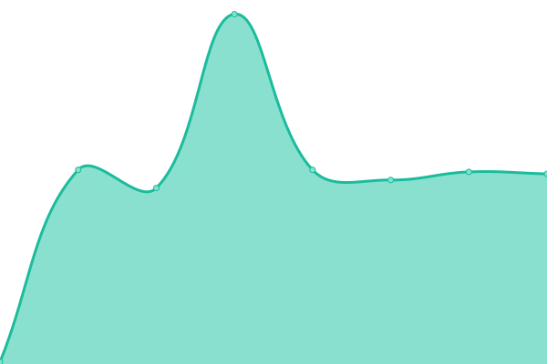
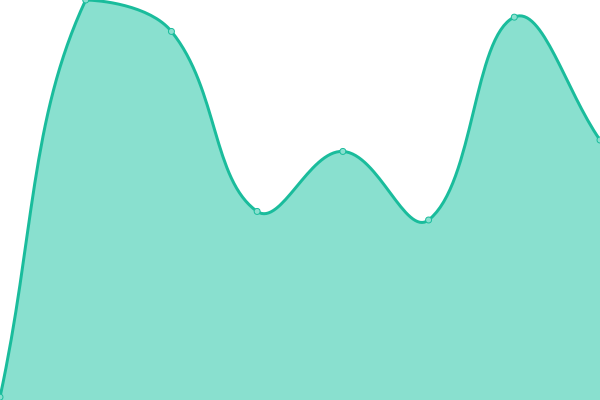
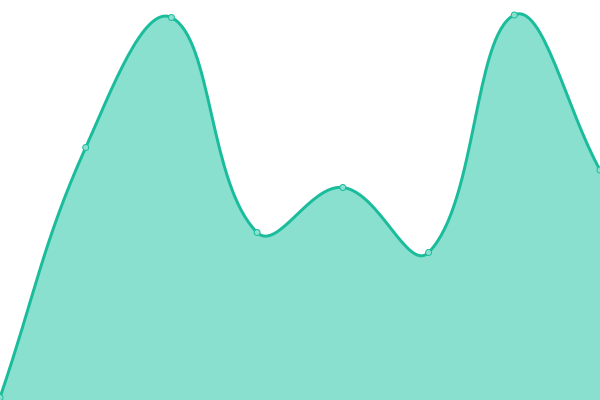
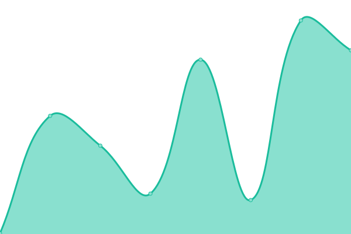

# [📈 Live Status](https://CResuelve.github.io/uptime): <!--live status--> **🟧 Partial outage**

This repository contains the open-source uptime monitor and status page for [CResuelve](https://CResuelve.github.io/uptime), powered by [Upptime](https://github.com/upptime/upptime).

With [Upptime](https://upptime.js.org), you can get your own unlimited and free uptime monitor and status page, powered entirely by a GitHub repository. We use [Issues](https://github.com/CResuelve/uptime/issues) as incident reports, [Actions](https://github.com/CResuelve/uptime/actions) as uptime monitors, and [Pages](https://CResuelve.github.io/uptime) for the status page.

<!--start: status pages-->
<!-- This summary is generated by Upptime (https://github.com/upptime/upptime) -->
<!-- Do not edit this manually, your changes will be overwritten -->
<!-- prettier-ignore -->
| URL | Status | History | Response Time | Uptime |
| --- | ------ | ------- | ------------- | ------ |
|  [Google](https://www.google.com) | 🟩 Up | [google.yml](https://github.com/CResuelve/uptime/commits/HEAD/history/google.yml) | 

 91ms
     
 | 

<a href="https://CResuelve.github.io/uptime/history/google">99.73%</a>
    

|  [Nikoton](https://nikoton.online) | 🟩 Up | [nikoton.yml](https://github.com/CResuelve/uptime/commits/HEAD/history/nikoton.yml) | 

 142ms
     
 | 

<a href="https://CResuelve.github.io/uptime/history/nikoton">100.00%</a>
    

|  [Cats](https://www.catshouse.live/) | 🟩 Up | [cats.yml](https://github.com/CResuelve/uptime/commits/HEAD/history/cats.yml) | 

 328ms
     
 | 

<a href="https://CResuelve.github.io/uptime/history/cats">100.00%</a>
    

|  [CResuelve Link](https://cresuelve.github.io/littlelink/) | 🟥 Down | [c-resuelve-link.yml](https://github.com/CResuelve/uptime/commits/HEAD/history/c-resuelve-link.yml) | 

 90ms
     
 | 

<a href="https://CResuelve.github.io/uptime/history/c-resuelve-link">0.00%</a>
    

|  [CResuelve Page Example](https://carlosarsgoetia.github.io/criptoresuelve/) | 🟩 Up | [c-resuelve-page-example.yml](https://github.com/CResuelve/uptime/commits/HEAD/history/c-resuelve-page-example.yml) | 

 114ms
     
 | 

<a href="https://CResuelve.github.io/uptime/history/c-resuelve-page-example">100.00%</a>
    

|  [CRsuelve Official Page](https://cresuelve.site/) | 🟩 Up | [c-rsuelve-official-page.yml](https://github.com/CResuelve/uptime/commits/HEAD/history/c-rsuelve-official-page.yml) | 

 101ms
     
 | 

<a href="https://CResuelve.github.io/uptime/history/c-rsuelve-official-page">100.00%</a>
    

<!--end: status pages-->

[**Visit our status website →**](https://CResuelve.github.io/uptime)

## 📄 License

- Powered by: [Upptime](https://github.com/upptime/upptime)
- Code: [MIT](./LICENSE) © [Anand Chowdhary](https://anandchowdhary.com), supported by [Pabio](https://pabio.com)
- Data in the `./history` directory: [Open Database License](https://opendatacommons.org/licenses/odbl/1-0/)
